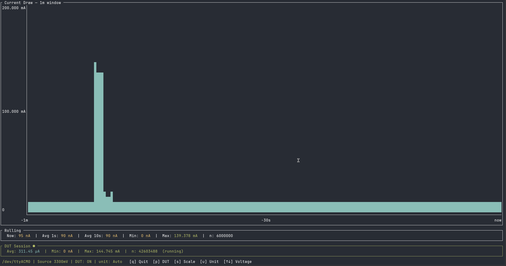

# ppk2tui

A terminal UI for the [Nordic Semiconductor Power Profiler Kit 2 (PPK2)](https://www.nordicsemi.com/Products/Development-hardware/Power-Profiler-Kit-2).

Connects via USB serial, reads 100 kHz current samples, and displays a live chart with rolling and session statistics.



## Requirements

- Docker and Docker Compose. The [buildx](https://github.com/docker/buildx)
  plugin (`docker-buildx-plugin` on Debian/Ubuntu) is recommended — without it
  Docker falls back to the deprecated legacy builder, which still works but can
  only produce a native-architecture image.
- PPK2 connected via USB (default: `/dev/ttyACM0`)

## Build and run

```sh
docker compose build
docker compose run ppk2tui --port /dev/ttyACM0
```

The running build is shown in the top-right of the chart border and by
`ppk2tui --version`. `.git` is excluded from the Docker build context, so stamp
the commit in explicitly or it reports `unknown`:

```sh
PPK2TUI_GIT_SHA=$(git rev-parse --short HEAD) docker compose build
```

If your device appears on a different port:

```sh
PPK2_PORT=/dev/ttyACM1 docker compose run ppk2tui --port /dev/ttyACM1
```

### From the prebuilt image

A docker image is published to GHCR:

```sh
docker run --rm -it \
  --device /dev/ttyACM0 \
  -e TERM=xterm-256color \
  -v "$PWD:/data" \
  ghcr.io/ttydma/ppk2tui:latest \
  --port /dev/ttyACM0 --mode source --voltage 3300 --log /data/run.csv
```

### Without Docker

ppk2tui is a single Rust binary, so you can also build and run it natively with a [Rust toolchain](https://rustup.rs/):

```sh
cargo build --release
./target/release/ppk2tui --port /dev/ttyACM0
```

On Linux you may need permission to access the serial device (e.g. add your user to the `dialout` group, or run with `sudo`).

## Options

```
  -p, --port <PORT>       Serial port (required)
  -m, --mode <MODE>       ampere or source [default: ampere]
  -v, --voltage <MV>      Source voltage in mV, 800–5000 [default: 3300]
  -l, --log <FILE>        Log avg/min/max to CSV (one row per bucket)
      --log-interval-us <US>  CSV bucket size in µs [default: 100000]
```

### High-resolution logging

```sh
# 10 µs = one row per sample (100 kSps): full resolution, ~4 MB/s
ppk2tui --port /dev/ttyACM0 --log burst.csv --log-interval-us 10

# 100 µs = 10 samples per row: keeps sub-millisecond shape, 10x smaller
ppk2tui --port /dev/ttyACM0 --log burst.csv --log-interval-us 100
```

Columns are `elapsed_us,avg_ua,min_ua,max_ua,n_samples`. Timestamps are derived
from the sample index at 100 kSps rather than the wall clock, so rows land on
exact sample boundaries. Charge over any span is `avg_ua × n_samples × 10 µs`.

## Key bindings

| Key | Action |
|-----|--------|
| `p` | Toggle DUT power |
| `s` | Cycle time scale (1s → 5s → 10s → 30s → 1m → 5m → 10m) |
| `u` | Cycle units (Auto / µA / mA) |
| `↑` / `↓` | Adjust source voltage ±100 mV (source mode only) |
| `q` | Quit |
